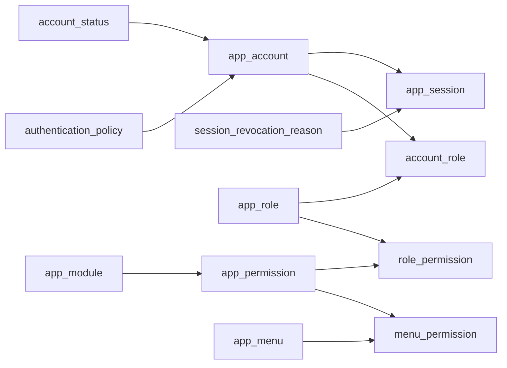

# Study Guide 01: Authentication and Application Security

This guide explains only the authentication, session, role, permission, and
menu-access portion of the WMS database. Master data and workflow
configuration are intentionally outside this guide and will be studied next.

## 1. Scope

The security model contains these 12 tables:

| Area | Tables |
|---|---|
| Account authentication | `app_account`, `account_status`, `authentication_policy` |
| Login sessions | `app_session`, `session_revocation_reason` |
| Roles and permissions | `app_role`, `account_role`, `app_permission`, `role_permission` |
| Application navigation | `app_module`, `app_menu`, `menu_permission` |

The most important distinction is:

| Concept | Purpose |
|---|---|
| Authentication | Confirms who the user is. |
| Session | Remembers a successful login for later requests. |
| Authorization | Determines what the authenticated user may do. |
| Menu visibility | Determines which navigation items the frontend displays. |

Menu visibility is not authorization. The backend must still check permission
before executing a protected operation.

## 2. Relationship overview



Authorization can be read as:

```text
Account
  -> assigned roles
  -> permissions granted to those roles
  -> operations the account may perform
```

Menu visibility can be read as:

```text
Account permissions
  -> permissions mapped to a menu
  -> menus visible to the account
```

## 3. Account authentication tables

### 3.1 `app_account`

One row represents one application account.

| Column | Meaning |
|---|---|
| `account_id` | Internal UUID primary key. |
| `username` | Unique login name. |
| `email` | Optional unique email address; may also be used to find the account during login. |
| `display_name` | Human-readable name shown by the application. |
| `password_hash` | Argon2id/bcrypt password hash for a local account; never a plain password. |
| `external_subject` | Stable identity supplied by an external SSO provider. |
| `account_status_id` | Administrative login status. |
| `authentication_policy_id` | Optional account-specific authentication policy. |
| `preferred_timezone` | Preferred timezone for displaying dates and times. |
| `failed_login_count` | Number of unsuccessful password attempts since the last successful login. |
| `locked_until` | Time until which automatic login lockout applies. |
| `last_login_at` | Time of the most recent successful login. |
| `created_by`, `updated_by` | Accounts that created and last updated this account. |
| `version_no` | Optimistic-lock version used to prevent lost updates. |

The database constraint requires at least one identity mechanism:

```text
password_hash is present OR external_subject is present
```

Both may be present if the application deliberately supports a hybrid local
and SSO account.

#### What is `external_subject`?

`external_subject` is the stable user identifier from an identity provider,
normally the OpenID Connect `sub` claim. It is not an email address or display
name because those values can change.

Example:

```text
external_subject = "a71f4908-2700-41f9-a7e5-128bca4175d2"
```

The current model is sufficient when the application trusts one identity
provider. If several providers will be supported, add an issuer identifier and
make `(external_issuer, external_subject)` unique because an OIDC subject is
only guaranteed to be unique within its issuer.

### 3.2 `account_status`

This is master data for administrative account states. Login behavior uses the
`allows_login` flag instead of hardcoding a particular status code.

Current starter data:

| Code | `allows_login` | Meaning |
|---|:---:|---|
| `ACTIVE` | Yes | Account may authenticate. |
| `PENDING` | No | Waiting for activation. |
| `LOCKED` | No | Administratively locked. |
| `DISABLED` | No | No longer permitted to authenticate. |

Additional statuses such as `SUSPENDED` or `BLOCKED` can be inserted without a
table change.

`account_status.is_active` and `account_status.allows_login` have different
meanings:

- `is_active` says whether the status master row is still in use.
- `allows_login` says whether accounts carrying that status may log in.

An administratively locked account uses an account status whose
`allows_login = false`. A temporary lock caused by failed passwords uses
`app_account.locked_until`. These are intentionally separate mechanisms.

### 3.3 `authentication_policy`

This table makes password-failure and session-lifetime rules configurable.

| Column | Meaning |
|---|---|
| `max_failed_attempts` | Failed attempts allowed before temporary lockout. |
| `lockout_seconds` | Duration of the temporary lockout. |
| `session_ttl_seconds` | Maximum absolute lifetime of a newly created session. |
| `is_default` | Fallback policy for accounts without a specific policy. |
| `is_active` | Whether the policy may currently be used. |

The starter policy is:

```text
code                 = DEFAULT
max_failed_attempts  = 5
lockout_seconds      = 900      (15 minutes)
session_ttl_seconds  = 28800    (8 hours)
```

Policies should be named for their purpose, for example:

| Code | Possible use |
|---|---|
| `DEFAULT` | Normal users |
| `STRICT_ADMIN` | Administrators with a short session lifetime |
| `WAREHOUSE_DEVICE` | Shared operational device with a suitable device policy |

If `app_account.authentication_policy_id` is null, the login queries select
the active default policy.

`session_ttl_seconds` currently creates an absolute expiry:

```text
expires_at = login time + session_ttl_seconds
```

It is not presently an idle timeout. `last_seen_at` is recorded, but it does
not extend `expires_at` or independently expire an idle session.

### 3.4 Failed-login behavior

The intended sequence is:

1. Find the account and applicable authentication policy.
2. Verify the password hash in the backend, never in SQL.
3. When verification fails, increment `failed_login_count`.
4. When the maximum is reached, set:

   ```text
   locked_until = current time + lockout_seconds
   ```

5. Do not change `account_status_id` for this automatic lockout.
6. A successful login resets `failed_login_count` to zero and clears
   `locked_until`.

The current session validation also rejects existing sessions while
`locked_until` is in the future. This is a security-policy decision to confirm
before backend development: a failed-login lockout can either block only new
login attempts, or temporarily invalidate all existing sessions. The provided
queries currently implement the second behavior.

## 4. Session tables

### 4.1 `app_session`

One row represents one login session on one browser or device.

| Column | Meaning |
|---|---|
| `session_id` | Application-generated varchar session identifier. |
| `account_id` | Account that owns the session. |
| `token_hash` | Hash of the secret session token, not the raw cookie value. |
| `issued_at` | When the session was created. |
| `expires_at` | Absolute expiration time. |
| `last_seen_at` | Last time a validated request touched the session. |
| `revoked_at` | When the session was intentionally invalidated. |
| `session_revocation_reason_id` | Reason the session was invalidated. |
| `ip_address` | IP address observed when the session was created. |
| `user_agent` | Browser/device description supplied in the HTTP request. |

#### Cookie and token handling

The secure flow is:

```text
Backend generates a cryptographically random raw token
  -> raw token is returned in a secure cookie
  -> SHA-256 hash of the token is stored in app_session.token_hash
```

For each request:

```text
Cookie raw token
  -> backend hashes token
  -> database finds token_hash
  -> session and account conditions are validated
```

The cookie should normally be `HttpOnly`, `Secure`, and configured with an
appropriate `SameSite` value. The raw token must not be stored in the database
or application logs.

`ip_address` is audit information in the current design. Session validation
does not require the current IP to equal the login IP because legitimate IPs
can change due to mobile networks, proxies, and NAT.

#### Valid-session conditions

A stored session is usable only when all relevant conditions are true:

```text
token hash exists
revoked_at is null
expires_at is in the future
account status is active and allows login
locked_until is null or has passed
```

A user stays logged in because the browser retains its raw cookie token, not
because the current IP has a session row. A new browser or device normally has
no cookie and therefore requires a new login.

The current model allows one account to have multiple active sessions.
Enforcing one active session per account would require a separate rule and a
change to the login transaction.

### 4.2 `session_revocation_reason`

Revocation intentionally invalidates a session before `expires_at`.

Starter reasons include:

| Code | Meaning |
|---|---|
| `USER_LOGOUT` | User logged out from the current session. |
| `USER_LOGOUT_ALL` | User logged out from every active session. |
| `PASSWORD_CHANGED` | Sessions were invalidated after a password change. |
| `ACCOUNT_DISABLED` | Sessions were invalidated because the account was disabled. |
| `ADMIN_REVOKED` | Administrator manually invalidated the session. |

Logout updates `revoked_at` and the reason instead of immediately deleting the
row. Retaining the row supports security audits. Old expired/revoked rows can
later be removed by a scheduled retention job.

## 5. Roles and permissions

### 5.1 `app_role`

A role groups permissions around a job responsibility.

Examples:

```text
SUPER_ADMIN
WAREHOUSE_MANAGER
INBOUND_OPERATOR
QC_OPERATOR
PICKER
BILLING_OPERATOR
```

The schema does not currently implement role inheritance or role hierarchy.

### 5.2 `account_role`

This bridge table creates the many-to-many relationship between accounts and
roles. One account can have several roles, and one role can belong to many
accounts.

`valid_from` and `valid_until` support temporary assignments.

`assigned_by` is the account that performed the assignment. It is an audit
field, not a parent role or a role above the assigned account. The database
does not itself prove that `assigned_by` had authority; the backend must check
a permission such as `ROLE.MANAGE` before inserting the assignment.

### 5.3 `app_module`

A module represents a business area of the application, not an action.

Current module codes include:

```text
AUTH
SECURITY
MASTER
INBOUND
INVENTORY
OUTBOUND
BILLING
REPORTING
GENERAL
```

Actions such as read, create, update, approve, receive, or delete belong in
permission codes.

### 5.4 `app_permission`

A permission is a specific application capability.

Example:

```text
code        = INBOUND.PO.READ
name        = View purchase orders
module_code = INBOUND
```

Other existing examples are:

```text
INBOUND.PO.CREATE
INBOUND.PO.APPROVE
INBOUND.RECEIVE
INBOUND.QC
INBOUND.DISPOSITION
INBOUND.REWORK
INBOUND.PUTAWAY
```

Therefore this would be incorrect:

```text
module_code = INBOUND.VIEW
```

`module_code` must reference `app_module.code`, so it should be `INBOUND`.

Permission codes are stable contracts between configuration data and backend
authorization checks. The permission records are data-driven, but the backend
will still refer to stable codes when protecting an operation.

The current effective-permission query checks `app_permission.is_active` but
does not check `app_module.is_active`. If deactivating a module should
immediately revoke all permissions inside it, the authorization query should
also join `app_module` and require the module to be active.

### 5.5 `role_permission`

This bridge table grants permissions to roles.

Example:

```text
INBOUND_OPERATOR role
  -> INBOUND.PO.READ
  -> INBOUND.RECEIVE

QC_OPERATOR role
  -> INBOUND.PO.READ
  -> INBOUND.QC
```

`granted_by` and `granted_at` record who granted the permission and when. As
with `assigned_by`, the backend is responsible for checking the actor's
authority before inserting the record.

The effective permissions of an account are the union of permissions from all
currently valid, active roles assigned to it.

## 6. Menus

### 6.1 `app_menu`

This table defines frontend navigation.

| Column | Meaning |
|---|---|
| `menu_id` | UUID technical primary key. |
| `parent_menu_id` | Optional parent menu for hierarchical navigation. |
| `code` | Stable business identifier such as `INBOUND` or `RECEIVING`. |
| `label` | Text displayed to the user. |
| `route` | Frontend route; null for a grouping menu if appropriate. |
| `icon_name` | Frontend icon identifier. |
| `display_order` | Sorting order among menu items. |
| `require_all_permissions` | Whether all mapped permissions, instead of any one, are required. |

Example hierarchy:

```text
Inbound
  -> Purchase Orders
  -> Receiving
  -> Quality Control
  -> Quarantine
  -> Putaway
```

The value `INBOUND` belongs in `app_menu.code`; `menu_id` remains a UUID.

### 6.2 `menu_permission`

This bridge table controls menu visibility by mapping menus to permissions.

Suppose a menu is mapped to:

```text
INBOUND.PO.READ
INBOUND.PO.CREATE
```

Then:

| Configuration | Visibility rule |
|---|---|
| `require_all_permissions = false` | Account needs at least one mapped permission. |
| `require_all_permissions = true` | Account needs every mapped permission. |
| No `menu_permission` records | Menu is visible to every valid account. |

Even when a menu is hidden, its API must remain protected by an independent
permission check. A user can attempt to call an endpoint without using the
menu.

## 7. End-to-end examples

### Example A: successful login

```text
1. User submits username and password.
2. Backend loads app_account and its authentication policy.
3. Backend verifies password against password_hash.
4. Account status must allow login.
5. Temporary locked_until must have passed.
6. Backend resets failed_login_count and locked_until.
7. Backend generates a session ID and secret raw token.
8. Database stores only the token hash and calculated expires_at.
9. Browser receives the raw token in a secure cookie.
```

### Example B: permission resolution

```text
Account: Budi
  -> account_role: INBOUND_OPERATOR
  -> role_permission: INBOUND.RECEIVE
  -> operation allowed: receive inbound goods
  -> menu_permission: Receiving menu becomes visible
```

### Example C: logout

```text
1. Browser sends its raw session token.
2. Backend hashes the token.
3. app_session is updated with revoked_at.
4. Reason is set to USER_LOGOUT.
5. Browser cookie is cleared.
6. The retained database row provides an audit trail.
```

## 8. Design decisions to confirm before backend development

These are policy choices rather than normalization problems:

1. Should a temporary failed-login lock invalidate existing sessions, or only
   prevent new logins?
2. Is session expiration absolute only, or is an idle timeout also required?
3. Are multiple simultaneous sessions allowed for one account?
4. Should password change revoke every active session?
5. Will the application support one SSO issuer or several issuers?
6. Should deactivating an application module disable all permissions within
   that module?
7. How long should expired and revoked sessions be retained for audit?

These decisions should be finalized before backend authentication middleware
is implemented because they change login and session-validation behavior.

## 9. Source files

- [Security table DDL](../../wms_schema.sql)
- [Authentication and authorization queries](../../auth_queries.sql)
- [Default policies, statuses, reasons, modules, permissions, and menus](../../master/00_bootstrap_reference_data.sql)
- [Security ER diagram](../../erd/domains/security.mmd)

## 10. Suggested study checklist

- [ ] Understand local-password authentication versus external SSO identity.
- [ ] Understand administrative status versus automatic temporary lockout.
- [ ] Trace how a raw cookie token becomes `token_hash`.
- [ ] Identify every condition required for a valid session.
- [ ] Trace an account through roles to effective permissions.
- [ ] Explain why menu visibility is not backend authorization.
- [ ] Decide the seven open security policies listed above.
